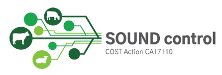

```{r rendering, eval=FALSE, include=FALSE}
rmarkdown::render('Session_Preparation.Rmd', 'html_document')
```

```{r, echo=FALSE}
set.seed(2022-03-23)
```

# Introduction

This document summarizes the pre-course material for the workshop on the available statistical methods to prove freedom from infection in an output-based framework, that will be held in the SVEPM conference on 23 March 2022. The workshop involves both demonstration and hands-on training, so it is important that you bring a laptop with all the necessary software installed. Please read carefully the instructions provided below on how to download all necessary software to make sure that your computer has all the software installed  for the workshop. All the training material, presented during this workshop, will be available for download from GitHub. The document concludes with the basic topics that we will cover in this workshop and an optional exercise.

### Required time: (~) 1 hour


# Software installation

First of all, you need to install R (click [here](https://cran.r-project.org/) (version 4.0.0 or later)) and Rstudio(Click [here](https://www.rstudio.com/products/rstudio/download/)).

The Just Another Gibbs Sampler -JAGS- software needs to be downloaded and installed too. You can download the latest version from [here](https://sourceforge.net/projects/mcmc-jags/files/JAGS/4.x/).

After successful installation of R, RStudio and JAGS, you will have to install, the latest versions of the following R-packages either from CRAN or using the `install.packages()` function, through the RStudio console: `rjags`, `runjags`, `coda`, `TeachingDemos`, `remotes`, `ggplot2`.

Example code: Install more than one package using the `install.packages()` function:
``` {r, results="hide", message=FALSE}
#install.packages(c("rjags", "runjags))
```


## 1st Milestone
Execute the following R-commands to make sure that you completed the steps above and installed the software correctly. If no errors are reported then you are doing great.

```{r, results="hide", message=FALSE}
stopifnot(getRversion() >= "4.0.0")
stopifnot(require('rjags'))
stopifnot(require('runjags'))
stopifnot(require('coda'))
stopifnot(require('TeachingDemos'))
stopifnot(require("remotes"))
stopifnot(require('ggplot2'))
stopifnot(testjags()$JAGS.available)
stopifnot(numeric_version(testjags()$JAGS.version) >= "4.3.0")
stopifnot(testjags()$rjags.found)
stopifnot(numeric_version(testjags()$rjags.version) >= "4-8")
```


Lastly, you will need to install the `STOCfree package` and it's associated R-packages (`tidyverse`, `CmdStanR`, `posterior`). The `CmdStanR` R-package is not available to install from CRAN, so we will install it from GitHub using the `remotes` package. The `posterior` package can be installed with the `install.packages()` function.

## 2nd Milestone
Execute the following R-commands to install the `tidyverse`, `CmdStanR` and `posterior` packages. 
(Execute the following lines of code without the # symbol)
```{r, results="hide", message=FALSE}
#remotes::install_github("r-lib/rlang")
#install.packages("tidyverse")
#remotes::install_github("stan-dev/cmdstanr")
#install.packages("posterior")
```

Execute the following R-commands to make sure that you completed the steps above and installed the software correctly. If no errors are reported then you are doing great.
```{r, results="hide", message=FALSE}
stopifnot(require("rlang"))
stopifnot(require('tidyverse'))
stopifnot(require("cmdstanr"))
stopifnot(require('posterior'))
```

Now you are ready to install from GitHub the `STOCfree package` running the following code within RStudio and select option 1 to install all update packages:
```{r, results="hide", message=FALSE, warning=FALSE}
remotes::install_github("AurMad/STOCfree")
```

Let's check if the `STOCfree package` has been installed correctly:
```{r, results="hide", message=FALSE, warning=FALSE}
stopifnot(require("STOCfree"))
```


All done and everything is working OK? Congrats! You have successfully installed all necessary software for the workshop.

If you have any difficulties installing the software or get errors, please let us know as soon as possible to resolve them before or during the workshop.

# Training material repository

All training material (lecture notes, R/JAGS/Stan code) will be disseminated via GitHub. The GitHub repository will be maintained after the workshop too. The repository is accessed by clicking [here](https://github.com/LefMel/SVEPM_2022_wk).

For each item in the workshop's agenda we have prepared a presentation but throughout the workshop it is suggested that you use the .Rmd files, because they allow both to execute R code and read the associated text with instructions and steps. 

It is recommended that you download all the material from the GitHUb repository 1 or 2 days before the workshop to have the latest version in the local folders of your computer. 

If you are already familiar with GitHub you can clone the repository and fetch the latest version again 1 or 2 days before the event.

## Not familiar with GitHub? click [here](https://docs.github.com/en/get-started) for a tutorial on how to use GitHub.


# Topics of this Workshop

The aim of this workshop is to introduce the relevant concepts of proving disease freedom and provide hands-on training on the current statistical methods. The text and code below are designed so that you can become familiar both with the terminology and the methods that will be presented during the workshop. The workshop is designed to have both demonstration and hands-on teaching. We have an introductory presentation to describe the concept of freedom from infection. Afterwards we describe three main methods that are used or have the potential to be used for substantiating freedom from infection. For each method we will go over the key points and line-by-line the associated R-code chunks. Some basic knowledge of R is assumed for this workshop. 

# Optional Exercise - Substantiating freedom from infection as a statistical problem

Imagine a large population in which 20% of individuals are infected. Although a random sample of 10 should contain 2 infected individuals on average, each particular sample could include between 0 and 10 infected individuals. Use the `dbinom` function to calculate the probability of detecting 0 infected individuals. What does the output represent? Change the values for the prevalence and the sample size and see how the output varies.

# Optional Exercise - Solution

```{r, eval=FALSE}
# x = 0, size = 10, prob = 0.2:
dbinom(0,10,0.2)
```

The output probability represents the probability of freedom from infection, meaning that there is 10.7% that the population is infection-free, assuming a sample of 10 individuals and a prevalence of 20%.

Let's increase the prevalence at 40%, i.e., prob = 0.4 and leave the sample size same, i.e., size = 10.
```{r, eval=FALSE}
dbinom(0,10,0.4)
```

The output probability now is 0.6%.

Let's increase the sample size to 100, i.e., size = 100 and leave the prevalence the same, i.e., prev = 0.2.
```{r, eval=FALSE}
dbinom(0,100,0.2)
```

The output probability is 0%.

Can you explain the results in each case?

\newpage

# Acknowledgements 

The workshop is conducted in the context of two COST Actions:   
CA17110 - **[SOUND-control](https://sound-control.eu/)** Standardizing OUtput-based surveillance to control Non-regulated Diseases of cattle in the EU  
CA18208 - **[HARMONY](https://harmony-net.eu/)** Novel tools for test evaluation and disease prevalence estimation

{width=3in} {width=3in}  


We are looking forward to seeing you in Belfast.

Please do not hesitate to contact us if you run into any problems with the software installation.

Eleftherios & Aurélien