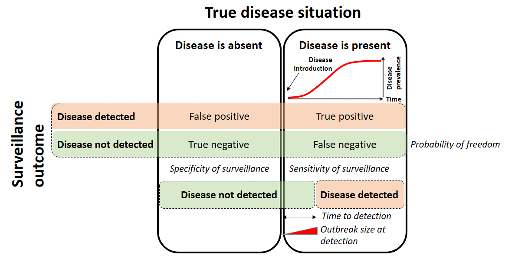

```{r setup, include=FALSE}
options(htmltools.dir.version = FALSE)
```

class: inverse, center, middle

# Objectives of this presentation

---
# Objectives

- Define the problem of substantiating freedom from disease as a statistical problem

- List the main factors to take into account when assessing confidence in freedom

- Define the most important surveillance outputs to estimate when substantiating freedom from disease

- Define and explain the relevance of the design prevalence

---
class: inverse, center, middle

# Sampling

---
## Sampling for proving freedom from disease

- Evidence of infection sought by testing animals from the population of interest

--

 - Testing all the animals is usually too costly $\rightarrow$ sampling
 
--

 - $\geq 1$ (true) positive $\rightarrow$ infection is present
 
 - 0 test positive $\rightarrow$ infection is absent OR infection is present, but no infected included in the sample

--


- Most of the time, the problem consists in **quantifying the probability that the infection is not present given that it has not been detected**

--

- The question can be formulated as: 

 - **how sure are we that the infection is truly absent given that we did not find it?** or

 - **what is the probability of a false negative surveillance outcome?**

---
## Exercise 1

- Consider a large population in which 20% of animals are infected

- 10 animals of this population are tested with a perfect test

--

- What are the probabilities of getting 0 to 10 positives among 10 animals tested?

 - What is the statistical distribution to use?
 
 - Which parameters?

--

- Assuming a large population, the probability of getting $Y = k$ positive animals out of $n$ animals tested when the disease prevalence is $\pi$ follows a Binomial distribution:

$$p(Y = k) \sim Binomial(n, \pi) $$

---
## Exercise 1

- Consider a large population in which 20% of animals are infected

- 10 animals of this population are tested with a perfect test

- What are the probabilities of getting 0 to 10 positives among 10 animals tested?

 - Write the R code to display and plot the results

--

```{r}
dbinom(0:10, 10, .2)
```

---
## Exercise 1

- Consider a large population in which 20% of animals are infected

- 10 animals of this population are tested with a perfect test

- What are the probabilities of getting 0 to 10 positives among 10 animals tested?

 - Write the R code to display and plot the results

```{r, fig.height = 4}
barplot(dbinom(0:10, 10, .2))
```

---
## Exercise 1


```{r, fig.height = 4}
barplot(dbinom(0:10, 10, .2),
        names.arg = 0:10,
        xlab = "Number of test positives out of 10 animals tested")
```

---
## Exercise 2

- Compare what happens when:

 - 10 animals sampled / disease prevalence is 20%
 - 20 animals sampled / disease prevalence is 20%
 - 10 animals sampled / disease prevalence is 1%
 - 20 animals sampled / disease prevalence is 1%

---
## Exercise 2

```{r, fig.keep='none'}
par(mfrow = c(2, 2))
# n = 10, p = 20%
barplot(dbinom(0:10, 10, .2),
        names.arg = 0:10,
        xlab = "Number of test positives out of 10 animals tested",
        main = "Prevalence = 20%")
# n = 20, p = 20%
barplot(dbinom(0:10, 20, .2),
        names.arg = 0:10,
        xlab = "Number of test positives out of 20 animals tested",
        main = "Prevalence = 20%")
# n = 10, p = 1%
barplot(dbinom(0:10, 10, .01),
        names.arg = 0:10,
        xlab = "Number of test positives out of 10 animals tested",
        main = "Prevalence = 1%")
# n = 20, p = 1%
barplot(dbinom(0:10, 20, .01),
        names.arg = 0:10,
        xlab = "Number of test positives out of 20 animals tested",
        main = "Prevalence = 1%")
```

---
## Exercise 2

```{r, echo = FALSE, fig.width = 10}
par(mfrow = c(2, 2))
barplot(dbinom(0:10, 10, .2),
        names.arg = 0:10,
        xlab = "Number of test positives out of 10 animals tested",
        main = "Prevalence = 20%")

barplot(dbinom(0:10, 20, .2),
        names.arg = 0:10,
        xlab = "Number of test positives out of 20 animals tested",
        main = "Prevalence = 20%")

barplot(dbinom(0:10, 10, .01),
        names.arg = 0:10,
        xlab = "Number of test positives out of 10 animals tested",
        main = "Prevalence = 1%")

barplot(dbinom(0:10, 20, .01),
        names.arg = 0:10,
        xlab = "Number of test positives out of 20 animals tested",
        main = "Prevalence = 1%")
```

---
## Exercise 3

- What are the probabilities of (falsely) concluding that disease is absent when:
 - 10 animals sampled / disease prevalence is 20%
 - 20 animals sampled / disease prevalence is 20%
 - 10 animals sampled / disease prevalence is 1%
 - 20 animals sampled / disease prevalence is 1%

--

```{r}
dbinom(0, 10, .2)
dbinom(0, 20, .2)
dbinom(0, 10, .01)
dbinom(0, 20, .01)
```

---
## Key messages

- Finding out whether a disease is present in a population involves sampling animals from this population

--

- From a disease freedom perspective, the most problematic situation is when the population is declared free when the disease is in fact present
 - False negatives $\rightarrow$ lack of sensitivity of surveillance

--
 
- Surveillance can have a poor sensitivity because of the sampling scheme, even if the test used has a perfect sensitivity for the detection of diseased individuals

--

- Surveillance sensitivity $\nearrow$ when:

 - sample size $\nearrow$
 
 - prevalence $\nearrow$
 
 
---
class: inverse, center, middle

# Proving absence

---
class: inverse, center, middle


---
## Proving absence

- So far, we have posed the problem as finding a certain number of positives in our sample given a disease prevalence and a sample size:

$$p(Y = k | n, \pi)$$

--

- In this case, the sensitivity of surveillance can be seen as the probability of finding at least one positive:

$$SSe =  1 - p(Y = 0 |n, \pi)$$

--

- The specificity of surveillance is usually not a problem because all positive test results will be re-tested until either being confirmed as true positives or shown to be false positives

$$SSp = p(Y = 0 | \pi = 0) = 1 $$

--

- But when we want to prove that a disease is absent, we do not know the actual prevalence. We usually *hope* that it is 0. What we would like to know is:

$$p(\pi = 0|n, k)$$

- How to proceed?
 
---
## Proving absence

- Chosen approach: use of a **design prevalence**

--

- Principle:

 - Assume that the disease is present at some chosen prevalence $\pi_t$, called the *design prevalence*
 
 - Make hypotheses that can be tested from this design prevalence

 $$H_o: \pi \geq \pi_t$$
 $$H_A: \pi < \pi_t$$
 
--
 
 - Construct confidence intervals, estimate probabilities of error from these hypotheses

```{r, echo = FALSE, message=FALSE}
magick::image_read_pdf("./figs/tab_error_1.pdf")
```

---
class: inverse, center, middle

# Surveillance outputs

---
## Surveillance outputs

- In most cases where the objective is to prove freedom, surveillance will yield no positive test results

--

- Various outputs can be estimated from this:

 - Sensitivity of surveillance
 
 - Probability of freedom from infection
 
 - Expected cost of error
 
 - (Specificity of surveillance)
 
 - $\ldots$

--

- It is important that these outputs can be compared, because the aim is usually to prove to partners that it is safe to trade with you

$\Rightarrow$ **output-based surveillance**

---
## Output-based standards

- Considering the true disease status and the outcome of surveillance:

```{r, echo = FALSE, message=FALSE}
magick::image_read_pdf("./figs/tab_error_2.pdf")
```

---
## Specificity of surveillance

- Probability of a negative surveillance outcome when the infection is absent (true negative):

 $$SSp = p(O^-|D^-)$$

 - Usually assumed to be 1 (i.e. no false positive) $\rightarrow$ every positive test will be investigated until either proven to be a false positive or confirmed as a true positive
 
```{r, echo = FALSE, message=FALSE}
magick::image_read_pdf("./figs/tab_error_2.pdf")
```

---
## Sensitivity of surveillance

- Probability of a positive surveillance outcome when the infection is present (at the design prevalence)

 $$SSe = p(O^+|D^+)$$

```{r, echo = FALSE, message=FALSE}
magick::image_read_pdf("./figs/tab_error_2.pdf")
```

---
## Probability of freedom from infection

- Probability that the infection is absent when the outcome of surveillance is negative

  $$P_{free} = p(D^-|O^-)$$


```{r, echo = FALSE, message=FALSE}
magick::image_read_pdf("./figs/tab_error_2.pdf")
```

- is in fact the negative predictive value

  $$P_{free} = \frac{SSp.(1 - \pi_t)}{SSp.(1 - \pi_t) + (1-SSe) . \pi_t}$$
  
---
## Probability of freedom from infection

- Probability that the infection is absent when the outcome of surveillance is negative

  $$P_{free} = p(D^-|O^-)$$


```{r, echo = FALSE, message=FALSE}
magick::image_read_pdf("./figs/tab_error_3.pdf")
```

- since $SSp = 1$, can be written as:

  $$P_{free} = \frac{1 - \pi_t}{1-SSe.\pi_t}$$

---
## Expected cost of error

- Estimation of the cost of undetected infections

 $$ECE = (1 - P_{free}) . Cost_{error}$$
 
- Can be used to justify the total cost of surveillance

 $$TSC = Cost_{surveillance}+(1 - P_{free}).Cost_{error}$$

--
- Who is paying?

 - Cost for the seller or buyer?

 - Spread of infection, public health, lost markets $\ldots$


---
## Other outputs

- More recently, indicators of early detection considered, although not strictly related to infection freedom

 - Influence on the cost of error $\rightarrow$ the longer the time between introduction of infection, the higher the resulting costs




---
class: inverse, center, middle

# Imperfect tests
 
---
## Exercise 4

- Consider:
 - a sample of 100 animals 
 - with a population disease prevalence of 2%
 - a test with an animal-level sensitivity of 50% and a specificity of 100%
 
- What is the expected number of animals in each of the cells of the table below?
<br><br><br><br>

```{r, echo = FALSE, message=FALSE, out.height= 200, out.width = 400, fig.align='center'}
magick::image_read_pdf("./figs/tab_test_0.pdf")
```

---
## Exercise 4

- Consider:
 - a sample of 100 animals 
 - with a population disease prevalence of 2%
 - a test with an animal-level sensitivity of 50% and a specificity of 100%
 
- What is the expected number of animals in each of the cells of the table below?
<br><br><br><br>

```{r, echo = FALSE, message=FALSE, out.height= 200, out.width = 400, fig.align='center'}
magick::image_read_pdf("./figs/tab_test_1.pdf")
```

---
## Exercise 4

- For filling the table, you can use the following formulas:

<br><br><br>

```{r, echo = FALSE, message=FALSE, out.height= 225, out.width = 800, fig.align='center'}
magick::image_read_pdf("./figs/tab_test_2.pdf")
```

---
## Exercise 4

- How would you define the sensitivity of surveillance?

--

- **Sensitivity of surveillance:**

 - Probability of $\geq$ 1 or more positives out of the hundred animals tested, equivalently,
 
 - 1 - Probability of getting 0 positives

--

- In R, write a piece of code that computes this sensitivity

--

```{r}
1 - dbinom(0, 100, .01)
```
- We consider that the population is infected, so the 100 animals should be taken into account

- Out of these 100 individuals, there should be on average one test positive $\rightarrow p = 0.01$

- The binomial distribution gives us the probability of getting no positives, so we do not have to compute the probability of getting 1, 2, $\ldots$ positives

---
## Some technical details

- When the number of animals sampled is small compared to the size of the population of interest, the probability of getting $k$ test positives out of $n$ animals tested follows the Binomial distribution

$$p(Y = k) \sim Binomial(n, p)$$

- which is computed using the following formula:

$$p(Y = k) = \frac{n!}{k!(n-k)!} p^k(1-p)^{n-k}$$

- When $k = 0$ this simplifies greatly

$$p(Y = 0) = (1-p)^{n}$$

- In our case, $p = Se.\pi$, therefore:

$$p(Y = 0) = (1-Se.\pi)^{n}$$

- and

$$SSe = 1 - (1-Se.\pi)^{n}$$

---
## Some technical details

- You can check that:

```{r}
1 - dbinom(0, 100, 0.01)
```

- is equal to

```{r}
1 - (1 - .5 * .02)^100
```
