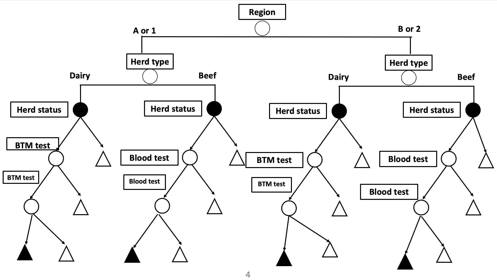

```{r setup, include=FALSE}
knitr::opts_chunk$set(echo = TRUE)
```

## Scenario tree method - Introduction

Reference quantitative method to estimate the probability of freedom from infection from complex surveillance systems  

Answers to:

* If infection was present at the design prevalence, what would be the probability of the surveillance system detecting at least 1 case?
  **Surveillance sensitivity**
* Given that no cases have been detected, what is the probability that the true prevalence of infection is lower than the design prevalence?
  **Probability of freedom from infection**

Principle: A surveillance system is represented as a tree with different components

## Scenario tree method - Simple Example

We will go through a simple example that will help understand
\begin{enumerate}
\item Scenario tree notation 
\item Scenario tree calculations
\end{enumerate}

- Objective: Estimation of the probability of freedom from Bovine Viral Diarrhea virus (BVDV) in country A (simple example) and Country B (complex example) 

##

The following figure shows the structure of the surveillance system for country A.


## Scenario tree method - Figure Explained

The surveillance system is split, given the herd type, to dairy and beef cattle.

We assume that the design prevalence is the same for both dairy and beef cattle.

Given the herd type a different diagnostic method to detect infection is applied.
\begin{itemize}
\item Dairy - Bulk Tank Milk
\item Beef - Blood  sample [e.g., serum ELISA]
\end{itemize}


## Scenario tree notation

* Herd type - (Risk) Category node
* Herd status - Infection node
* BTM test / Blood test - Detection nodes

\vspace{1cm}
* (Risk) Category node(s) - represent(s) (risk) factors dividing the surveillance system population into subsets with different probabilities of being infected
* Infection node - represent the infection status, branch probabilities derived from design prevalence
* Detection node(s) - represent(s) the detection of infection, associated with test characteristics 


## Scenario tree calculations (I)

#### Constraints
\begin{enumerate}
\item All final results from the surveillance system are consistent with country or zone freedom from infection
\item Specificity (Sp) of the surveillance system is 1 
\end{enumerate}

## Scenario tree calculations (II)

- Complex Surveillance systems can have more than one detection nodes (see example later)

- Units with a positive test outcome at the first detection node are retested (with a "better" method / more "specific" method). The final result has to be negative.

- The process of repeated testing (sequential testing)
\begin{enumerate}
\item Reduces the probability of a false-positive output in the surveillance system (SS) (Sp of SS = 1)
\item If a true-positive unit is detected then the country's/zone's claim of freedom from infection is no longer valid and the method is no longer applicable
\end{enumerate}

#### Extra Assumption
Often the Sps of the individual methods applied are considered 100%

## Simple Example - R code

#### Input parameters

* Design prevalence
* Test characteristics of BTM and Blood test
* Number of herds tested, per herd type

```{r}
# Design prevalence
p_design = 0.02
#Test characteristics
# BTM test
Se_BTM = 0.98
Sp_BTM = 1
# Blood test
Se_Blood = 0.95
Sp_Blood = 1
# Number of herds tested, per herd type
# Different scenario given sample size
n_dairy = seq(10,400,20)
n_beef = seq(10,600,10)
```

## Estimate Surveillance component sensitivity (SCSe)

\begin{block}{Surveillance component sensitivity (SCSe)}
  \begin{equation}
          SCSe = 1 - (1 - p^**Se)^n
  \end{equation}

  \begin{equation}
          OverallSSe = 1 - prod_{i=1}^{n}(1 - SCSe_n)
  \end{equation}
\end{block}  
```{r}
CSE_dairy = 1 - (1-(p_design*Se_BTM))^n_dairy
CSE_beef = 1 - (1-(p_design*Se_Blood))^n_beef

Overall_SSE = 1 - (1-CSE_dairy)*(1-CSE_beef)
```

Compare efficacies of the two SCs - Sensitivity ratio 

*Critical value is 1*

```{r}
Sensitivity_ratio = CSE_dairy/CSE_beef
```


## Estimate probability of freedom from infection

\begin{block}{Pr(freedom)}
  Pr(freedom) = Pr(D- | S-) = Negative Predictive Value
  \begin{equation}
  \begin{aligned}
  \begin{split}
  &Pr_f = Pr(D^- | S^-) = \frac{Pr(S^- | D^-) Pr(D^-))}{Pr(S^-)} =\\
  &\frac{Pr(S^- | D^-) Pr(D^-) )}{Pr(S^- | D^-) Pr(D^-) + Pr(S^-|D^+)*Pr(D^+)}\\ 
  &= \frac{Sp_S * (1-p^*)}{Sp_S * (1-p^*) + (1 - Se_S)*p^*}\\
  \end{split}
  \end{aligned}
  \end{equation}

\end{block}

\begin{block}{Assuming that Sp of SS = 1 then}
  \begin{equation}
        Pr_f = Pr(D^- | S^-) = \frac{(1-p^*)}{(1-p^*) + (1 - Se_S)*P^*}
  \end{equation}

\end{block}

```{r}
P_freedom=(1-p_design)/
  ((1-p_design)+p_design*(1-Overall_SSE))
```


## Another example - Homework Exercise
#### Introducing the Adjusted risk

Suppose the following scenario for a surveillance system for BVDV

* Country B has 2 regions
* In each region herds are divided given herd type to beef and dairy cattle
* Dairy cattle tested by BTM - if positive retested | Beef cattle tested with ELISA - if positive retested

Region 2 is sharing borders with a country that is known to be BVDV-positive - higher risk

* Relative_risk(region_2) = 4*Relative_risk(region_1) = 4
* Relative_risk(region_1) = 1


80% of the herds belong to Region 1

* 40% beef cattle | 60% dairy cattle

20% of the herds belong to Region 2

* 40% beef cattle | 60% dairy cattle

Design prevalence = 0.02

## Scenario tree - Figure

Construct the scenario tree for country B, with the information provided above.
Use scenario tree for country A, as a starting point. 


## Scenario tree - Figure
### DONE??



## Scenario tree - Figure Explained

* Now region is a risk category node! 

* The available relative risks have to be adjusted given the proportion of the population in each branch of the node.

The output value is known as **Adjusted Risk**.


## Calculation of Adjusted Risk

### Key Points

\begin{block}{Ratio of adjusted risks must remain the same as the original relative risk}
  \begin{equation}
      AR_1/AR_2 = RR_1/RR_2
  \end{equation}
\end{block}

\begin{block}{The average risk across the population is equal to 1}
  \begin{equation}
      AR_1 * Pr(Region_1) + AR_2 * Pr(Region_2) = 1
  \end{equation}
\end{block}

## Second Example - R code

AR_1 = 1/(Pr(Region_1) + RR_2 * Pr(Region_2))

AR_2 = RR_2 * AR_1

```{r}
RR_1 = 1
RR_2 = 4
P_region_1 = 0.8
P_region_2 = 0.2
```

```{r}
AR_1 = 1/(P_region_1 + RR_2*P_region_2)
AR_2 = RR_2 * AR_1
```

## Effective probability of infection


!!! As a last step we have to adjust for the design prevalence

The output defined as Effective Probability of infection (EPI) is equal to

\begin{block}{Formula}
  \begin{equation}
         EPI = AR*p^*
  \end{equation}
\end{block}

```{r}
p_design = 0.02
EPI_1 = AR_1*p_design
EPI_2 = AR_2*p_design
```

## Repeated testing

As pointed out if a unit tests positive in the first round of testing then it is retested with the same test.

Assuming independence between tests the overall sensitivity of the sequential testing is the product of the individual sensitivities

```{r}
#Test characteristics
# BTM test
Se_BTM = 0.98
Sp_BTM = 1
# Blood test
Se_Blood = 0.95
Sp_Blood = 1

Seq_Dairy = Se_BTM^2
Seq_Blood = Se_Blood^2
```

## Sample Size

```{r}
# Total herds sampled in Country B
n_total = seq(1000, 100000, 10)
# 80% Region 1 | 20% Region 2
# 40% beef | 60% dairy
n_1_dairy = 0.8 * 0.6 * n_total
n_1_beef = 0.8 * 0.4 * n_total
n_2_dairy = 0.2 * 0.6 * n_total
n_2_dairy = 0.2 * 0.4 * n_total
```
## Surveillance Sensitivity

We are now ready to estimate the component and overall surveillance sensitivities

```{r}
# d: dairy | b: beef
CSE_A_d = 1 - (1-(EPI_1*Seq_Dairy))^n_1_dairy
CSE_A_b = 1 - (1-(EPI_1*Seq_Blood))^n_1_beef

CSE_B_d = 1 - (1-(EPI_2*Seq_Dairy))^n_2_dairy
CSE_B_b = 1 - (1-(EPI_2*Seq_Blood))^n_2_dairy

Overall_SSE = 1 - 
  (1-CSE_A_d)*(1-CSE_A_b)*(1-CSE_B_d)*(1 - CSE_B_b)
```

## Estimate probability of freedom from infection


```{r}
P_freedom=(1-p_design)/
  ((1-p_design)+p_design*(1-Overall_SSE))
```


## Conclusions

* Questions???

Suggested literature

* Martin et al, (2007) Demonstrating freedom from disease using multiple complex data sources
* Norström et al, (2014) Estimation of the probability of freedom from BVDV in Norway using scenario tree modelling   

