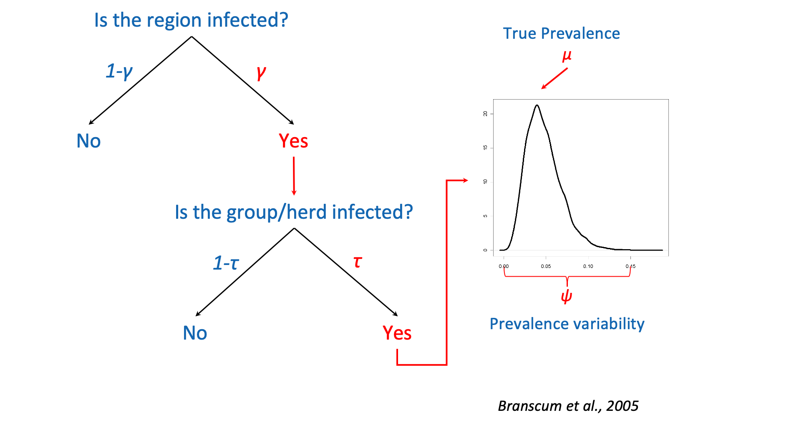
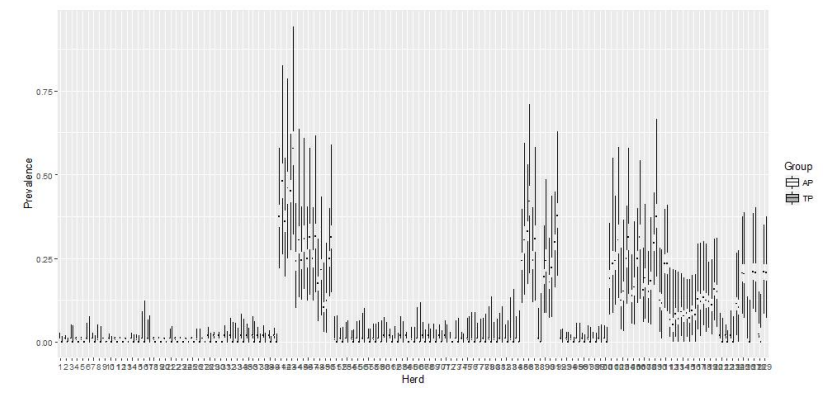
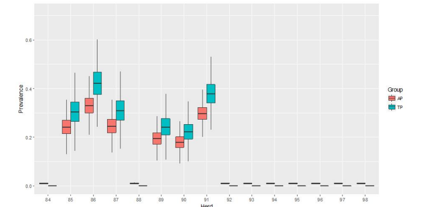
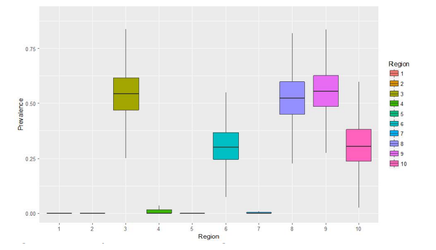

```{r setup, include=FALSE}
knitr::opts_chunk$set(echo = FALSE)
```

## Objectives of this Section

* Explain Bayes' theorem | Bayesian Inference
* Why apparent prevalence is different than true prevalence?
* Apply a simple apparent & true prevalence estimation model
* Understand the full hierarchical model

## Bayes' theorem 

\begin{block}{Bayes' rule}
  Describes the probability of an event based on prior knowledge
  \begin{equation}
      P(A|B) = \frac{P(B|A)*P(A)}{P(B)}
  \end{equation}
  
\end{block}

Components

* P(A|B): Prob of event A occurring given that B is true - Posterior probability
* P(B|A): Prob of event B occurring given that A is true - Likelihood ~ function of A
* P(A): Prob of event A occurring - Prior probability
* P(B): Prob of event B occurring - Marginal probability ~ sum over all possible values of A

## What we usually see/use

\begin{block}{Bayes' rule}
  {$\theta$: parameter of interest | y: observed data}
  \begin{equation}
  \begin{aligned}
  P(\theta|y) = \frac{P(y|\theta) * P(\theta)}{P(y)} \rightarrow  P(\theta|y)  \propto P(y|\theta) * P(\theta) 
  \end{aligned}
  \end{equation}
  
\end{block}

Where:

* P($\theta$): Prior probability of parameter(s) of interest;
* P(y/$\theta$): Likelihood of the data given the parameters value(s) 
* P($\theta$|y): Posterior probability of parameter(s) of interest given the data and the prior

## Bayesian Inference - Summary & Example

To estimate the posterior distribution P($\theta$|y) we need to:

* *Specify* the **Prior distribution**: P($\theta$)
* *Define* the **Likelihood** of the data: P(y|$\theta$) 

### Example: Bayesian apparent prevalence (ap) estimation

y out of n individuals test positive. Estimate the apparent prevalence.

\vspace{1cm}
Parameter of interest: ap$\epsilon$[0,1]

Data: n tested, y positive

* Prior distribution for ap: ap ~ Beta(a,b)
* Likelihood: y ~ Binomial(n,ap) 

## Let's write our first JAGS model

```{r, include=TRUE,echo=TRUE}
ap_model <- 
'model {
  
  # Define likelihood distribution of the data
  # JAGS Binomial distribution Arguments: p, n 
  
  y ~ dbin(ap,n)
  
  # Specify prior distribution for par of interest 
  # Uniform (non-informative) prior distribution 
  ap ~ dbeta(1,1)
  
  #data# n, y
  #monitor# ap
  #inits# ap
}
'
```

## Let's run our first JAGS model

```{r, echo=TRUE, fig.show='hide'}
# Call JAGS
library(runjags)

# Provide Data 
n = 4072
y = 1210

# Initial values for par of interest
ap <- list(chain1=0.05, chain2=0.95)
```

```{r, echo=TRUE, message=FALSE, warning=FALSE, results='hide'}
# Run the model
results <- run.jags(ap_model, n.chains=2, 
                    burnin=5000, sample=10000)
```

## View results

```{r, include=TRUE, results="hide"}
# Plot results
plot(results)
# Print results
summary(results)
```

## Example: Bayesian true prevalence (tp) estimation

Assuming the absence of a perfect test we do not know how many individuals are truly positive/negative.

Instead we know that *n* individuals are tested with an imperfect test and *y* have a positive result.

\begin{block}{Apparent and True prevalence}
  {Apparent/True prevalence: ap/tp | Sensitivity: Se | Specificity: Sp}
  \begin{equation}
  \begin{aligned}
  \begin{split}
  &ap = P(T^+) = P(T^+\bigcap D^+) + P(T^+\bigcap D^-) =\\
  &P(D^+) * P(T^+ | D^+) + P(D^-) * P(T^+ | D^- )\\
  & \rightarrow ap = tp * Se + (1 - tp) * (1 - Sp)\\
  \end{split}
  \end{aligned}
  \end{equation}

\end{block}

## Create a JAGS model for true prevalence estimation


Parameters of interest: 

* tp$\epsilon$[0,1]
* Se$\epsilon$[0,1]
* Sp$\epsilon$[0,1]

Prior distributions

* tp ~ dbeta(1,1)
* Se ~ dbeta(25.4, 3.4)
* Sp ~ dbeta(95, 5)

Data: n tested, y positive

* Likelihood: y ~ Binomial(n,ap), 
ap = tp * Se + (1 - tp) * (1 - Sp)

## Write JAGS model

```{r, include=TRUE,echo=TRUE}
tp_model <- 
'model {

  y ~ dbin(ap,n)
  ap <- tp*Se + (1-tp)*(1-Sp)
  
  # Uniform (non-informative) prior distribution 
  tp ~ dbeta(1,1)
  # Informative priors for Se and Sp
  Se ~ dbeta(25.4, 3.4)
  Sp ~ dbeta(95, 5)
  
  #data# n, y
  #monitor# tp, Se, Sp
  #inits# tp, Se, Sp
}
'
```

## Let's run our JAGS model

```{r, echo=TRUE, fig.show='hide'}
# Call JAGS
library(runjags)

# Provide Data 
n = 4072
y = 1210

# Initial values for pars of interest
tp <- list(chain1=0.05, chain2=0.95)
Se <- list(chain1=0.05, chain2=0.95)
Sp <- list(chain1=0.05, chain2=0.95)
```

```{r, echo=TRUE, message=FALSE, warning=FALSE, results='hide'}
# Run the model
results <- run.jags(tp_model, n.chains=2, 
                    burnin=5000, sample=10000)
```

## View results

```{r, include=TRUE, results="hide"}
# Plot results
plot(results)
# Print results
summary(results)
```

## Bayesian hierarchical true prevalence estimation


### Model breakdown

\vspace{0.5cm}

Captures the population structure and is divided in three parts that describe distribution of disease:


* Within herds which are
* Within regions in the
* Country under consideration

## Full Model Figure



## Model outputs

* Animal-level true prevalence of infection within infected herds
* Herd-level prevalence of infection in the region
* Region-level prevalence of infection
* Probability that the whole country is free from infection
* Probability of freedom from infection at each level of hierarchy
* Probability that infection does not exceed a pre-specified critical level (e.g. 5%) in a specific region

## Run the model with JAGS

The model and the data are already saved in the Section's folder.

Let's load and view the data.

```{r}
load(file="hier_data.Rdata")
```

```{r, echo=FALSE}
head(data.frame(hier_data[1:3]))
psi = list(chain1=0.5)
```

## Run the model
```{r, echo=FALSE, include=FALSE, warning=FALSE, cache=FALSE, message=FALSE}
hier_model <- run.jags("hier_model.txt",data=hier_data,
                       burnin=5000, sample=25000)
```

```{r, echo=FALSE, include=FALSE, warning=FALSE, cache=FALSE, message=FALSE}
res <- summary(hier_model)
```

## Visualise results (I)

### ap & tp in each herd

```{r, include=FALSE}
## Code for plots
```



## Visualise results (II)



## Visualise results (III)

### Herd-level prevalence in each region



## Conclusions

* Questions???

Suggested literature

* Kostoulas et al, (2019) Harmonisation Of Transmissible disease Interpretation in the EU  HOTLINE
* Branscum et al, (2004) Bayesian modeling of animal- and herd-level prevalences