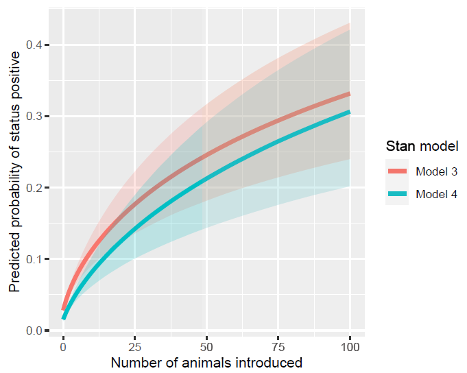

```{r setup, include=FALSE}
options(htmltools.dir.version = FALSE)
```

class: inverse, center, middle

# Objectives of this presentation

---
# Objectives

- Explain for which type of problems the model can be used

- Explain the principles of the model

- Use the model

- Interpret the model's results

---
class: inverse, center, middle

# Context

---
class: center, middle

## The STOC free project: [www.stocfree.eu](https://www.stocfree.eu/)


---

background-image: url("figs/STOCfree_partners.png")

---
## Context

- Disease surveillance programmes when the disease is still present

--

- **Objectives:**

 - identify infected herds

 - protect uninfected herds from infection within the programme
 
 - reassure trading partners from outside the programme
 
--

- **Aim of the model:**

 - estimate a probability of freedom from infection for all herds in the programme incorporating all the available information
 
---
## Modelling framework

- Model outcome: herd-level probability of being positive in the most recent month for which surveillance data are available

--

- Input data:

 - test results
 
 - risk factors
 
--

- Hidden Markov Model:

 - imperfect tests

 - latent status
 
 - monthly dynamics
 

--

- Bayesian inference:

 - requires priors
 
 - modelling in Stan (or JAGS)

--

- Model description: https://peercommunityjournal.org/articles/10.24072/pcjournal.80/

---
## Modelling framework


---
## Modelling framework


---
## Modelling framework


---
## Model priors

- Running the model requires prior distributions for

 - Test characteristics: sensitivity and specificity
 
 - Status dynamics: probability of being positive on the first test, probability of becoming positive, probability of remaining positive

---
class: inverse, center, middle

# Using the STOC free model

---
## The STOCfree R package

- Model available as an R package from GitHub

- The GitHub page contains the instructions to install and use the package

<br><br>
.center[https://github.com/AurMad/STOCfree]

---
## Computer programme for Bayesian inference

- The `STOCfree` package can use either Stan or JAGS to perform Bayesian inference

--

- JAGS: Just Another Gibbs Sampler

 - Similar to WinBUGS / OpenBUGS

--

- Stan:

 - More recent than JAGS
 
 - Uses Hamiltonian Monte Carlo for estimation $\rightarrow$ more efficient than older methods of sampling
 
 - The `STOCfree` package uses the CmdStan version of Stan
 
 - [Getting started with CmdStanR](https://mc-stan.org/cmdstanr/articles/cmdstanr.html)
 
- Stan is faster and works better
 
---
## Installing the STOCfree package

- From GitHub:

```{r, eval = FALSE}
remotes::install_github("AurMad/STOCfree")
```

- Attach the package:

```{r}
library(STOCfree)
```

- We will also need a few other packages

```{r, message=FALSE}
library(tidyverse)
library(ggplot2)
```


---
## BVDV surveillance dataset

- The package contains a toy dataset called `herdBTM` that we will use for demonstrating how to use the model

--

- Mimics what is done in some BVD surveillance programmes in French dairy herds:

 - BVDV specific antibodies are sought in a bulk tank milk sample
 - All herds in the programme are tested twice a year

--

```{r, echo = FALSE}
herdBTM %>% 
  filter(Test == "BTM_ODR")
```


---
## BVDV surveillance dataset

- The columns of `herdBTM` are:
 - `Farm`: Farm ID, from FR001 to FR100
 - `DateOfTest`: date of test
 - `ODR`: test result as an optical density ratio
 - `Test`: type of test used. We will only use BTM_ODR
 - `TestResult`: test result dichotomised based on the value in the `ODR` column
 - `LocalSeroPrev`: Proportion of seropositives in the municipality $\rightarrow$ risk factor


```{r}
glimpse(herdBTM)
```

---
## BVDV surveillance dataset

- Let's discard the data we will not need

```{r}
hbm <- herdBTM %>% 
  filter(Test == "BTM_ODR") %>% 
  select(Farm, DateOfTest, TestResult)

hbm
```


---
## Preparing the data for analysis

- The `STOC free model` works with `STOCfree_data` objects

--

- How to make a `STOCfree_data` object?

```{r}
sfd <- STOCfree_data(
  test_data = hbm,
  test_herd_col = "Farm",
  test_date_col = "DateOfTest",
  test_res_col = "TestResult"
)
```

---
## What is inside STOCfree_data objects?

```{r}
str(sfd, max.level = 1)
```

---
## Prior distributions for test characteristics

- Prior distributions must be provided for test characteristics
 - Beta distributions for sensitivity and specificity
 - Need to provide $\alpha$ and $\beta$
 
```{r}
show_tests(sfd)
```
 
---
## Prior distributions for test characteristics

- In order to identify the parameters that correspond to what we know about the test, we can use the `shiny_beta()` function from the  `betadistapp` package

- Install the package:

```{r, eval = FALSE}
remotes::install_github("AurMad/betadistapp")
```

--

- Launch the shiny app:

```{r, eval = FALSE}
betadistapp::shiny_beta()
```

--

- Set the priors for the test characteristics

```{r}
sfd <- set_priors_tests(
  x = sfd,
  Se_a = 80,
  Se_b = 20,
  Sp_a = 99,
  Sp_b = 1
)
```

---
## Prior distributions for test characteristics

- Check your prior distributions:

```{r}
show_tests(sfd)
```


---
## Prior distributions for test characteristics

- Display your prior distributions:

```{r, fig.height = 6, fig.width = 9, fig.align='center'}
plot_priors_tests(sfd)
```


---
## Prior distributions for infection dynamics

- Prior distributions must be provided for:

 - the probability of being positive ( $\pi_1$ )
 - the probability of becoming positive between consecutive months ( $\tau_1$ )
 - the probability of remaining positive between consecutive months ( $\tau_2$ )
 
--

- These priors are defined using normal distributions on the logit scale.

--

- What is this?

---
## Prior distributions for infection dynamics

- An event such as an infection is either absent ( $Y = 0$ ) or present ( $Y = 1$ )

--

- This event has a certain probability $p$ of occurrence with $p = 0$ denoting the certainty of absence and $p = 1$ denoting the certainty of presence.
 - $p$ can take all values between $0$ and $1$
 - $p$ cannot be outside the interval (0, 1)
 
--
 
- the logit transformation is as follows: 
$$logit(p) = ln \left( \frac{p} {1 - p} \right) $$

--

- the logit transformation allows to use distributions defined on ( $- \infty, + \infty$ )

- a value of 0 on the logit scale corresponds to a probability of 0.5

- the function is symmetric around 0

---
## Prior distributions for infection dynamics

```{r, echo=FALSE, fig.align='center', fig.height=7, fig.width=12}
par(mfrow = c(1, 2))
curve(log(x / (1 - x)), 
      from = 0, to = 1,
      xlab = "p",
      ylab = "logit(p)",
      main = "logit(p) as a function of p")
abline(h = 0, lty = 2, col = "red")
abline(v = .5, lty = 2, col = "red")

curve(exp(x) / (1 + exp(x)),
      from = -5, to = 5,
      xlab = "logit(p)",
      ylab = "p",
      main = "p as a function of logit(p)")
abline(v = 0, lty = 2, col = "red")
abline(h = .5, lty = 2, col = "red")
```

---
## Prior distributions for infection dynamics

- In order to identify the parameters that correspond to what we know about the infection dynamics, we can use the `shiny_logitnorm()` function from the  `logitnormdistapp` package

- Install the package:

```{r, eval = FALSE}
remotes::install_github("AurMad/logitnormdistapp")
```

--

- Launch the shiny app:

```{r, eval = FALSE}
logitnormdistapp::shiny_logitnorm()
```

--

- Set the priors for the test characteristics:

```{r}
sfd <- set_priors_status_dyn(sfd, 
                             logit_pi1_mean = -3,  logit_pi1_sd = 1, 
                             logit_tau1_mean = -3, logit_tau1_sd = 1, 
                             logit_tau2_mean = 3,  logit_tau2_sd = 1)
```


---
## Prior distributions for infection dynamics

```{r, fig.height=6.5, fig.align='center'}
plot_priors_status_dyn(sfd)
```

---
## Running the model

- In order to run the model, we use the `STOCfree_Stan()` function

```{r, eval = FALSE}
sfm_stan <- STOCfree_Stan(sfd,
                      n_chains = 3,
                      n_iter = 1000,
                      n_thin = 1,
                      out_path = "STOCfree_Stan_1")
```

- The model results are saved in a folder called `STOCfree_Stan_1`

- The model generates 2 types of outputs:

 - Model parameters: test characteristics, status dynamics
 - Probabilities of being positive on the last month of surveillance for each herd

---
## Analysing the results - model parameters

- Samples from model parameters' posterior distributions can be extracted from the model output

```{r, eval = FALSE}
param <- extract_STOCfree_param(sfm_stan)
```

- or from the place they were saved on the disk

```{r}
param <- read_STOCfree_param("STOCfree_Stan_1")
```

---
## Analysing the results - model parameters

- Traceplots for evaluating convergence

```{r, fig.height = 6, fig.align='center'}
plot(param, parameter = "Se", type = "traceplot")
```

---
## Analysing the results - model parameters

- Density plot

```{r, fig.height = 6, fig.align='center'}
plot(param, parameter = "Se", type = "density")
```

---
## Analysing the results - model parameters

- Summary

```{r}
summary(param)
```

---
## Analysing the results - predicted probabilities

- Results for the predicted probabilities of being positive can be extracted from the model output

```{r, eval = FALSE}
pred <- extract_STOCfree_pred(sfm_stan)
```

- or from the place they were saved on the disk

```{r}
pred <- read_STOCfree_pred("STOCfree_Stan_1")
```

---
## Analysing the results - predicted probabilities

```{r, fig.align='center', fig.height=6}
plot(pred)
```

---
## Analysing the results - predicted probabilities

```{r, fig.align='center', fig.height=6}
plot(pred, type = "individual")
```

---
## Analysing the results - predicted probabilities

```{r, fig.align='center', fig.height=6}
plot(pred, herd = c("FR001", "FR002"), type = "individual", legend = TRUE)
```

---
## Analysing the results - predicted probabilities

- MCMC summary values for the predicted probabilities of being positive in herds FR001 to FR009.

```{r}
summary(pred, herd = paste0("FR00", 1:9))
```

---
## Analysing the results - predicted probabilities


- The choice of which herds to categorise as *free from infection* is left to the user

 - e.g. we want to be 97.5% sure that the probability of infection is smaller or equal to 10%
 
```{r}
as_tibble(summary(pred)) %>% 
  filter(`97.5%` <= .1) 
```
 
---
class: inverse, center, middle

# Including risk factors

---
## Including risk factors

- The STOC free model allows the inclusion of risk factors of new infection

--

 - logistic regression model for the probability of new infection $\tau_1$
 - associations estimated from historical data
 - requires priors on the regression coefficients
 
--

- allows the probability of freedom from infection to be higher in herds in which known risk factors of infection are present

--

- could be used to trigger testing in these herds

---
## Including risk factors - example from the paper

.center[]


---
## Including risk factors - example from the paper

.center[]

---
## Including risk factors

- See the [Github page](https://github.com/AurMad/STOCfree) in order to see how to include risk factors

---
class: inverse, center, middle

# Thank you !


