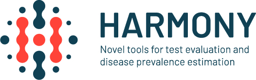

## Take-Home message

### Prevalence Context
 
Methods for freedom from infection can be adopted to each particular context

* Absence of infection is assumed: Scenario tree method 

Simulations based on hypotheses

* Presence of infection is assumed: Bayesian hierarchical true prevalence estimation, STOC free model 

Bayesian Inference

## Mentimeter

[Mentimeter Link](https://www.menti.com)

Mentimeter Code: 1474 6987

## Thank you all - Group Photo

{width=3in} 

\vspace{1cm}

{width=3in} 

